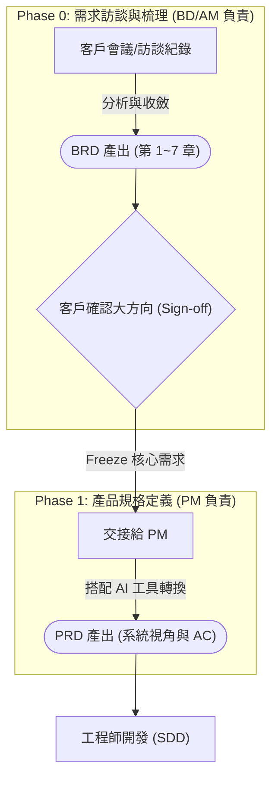

# 商業需求文件 (BRD) 架構指南

本指南旨在說明 Aiii 專案中所使用的商業需求文件 (Business Requirements Document, BRD) 標準架構。撰寫專案的 BRD 時，請務必遵循以下 7 大核心段落，確保需求梳理的完整性，這將作為後續 PRD (產品需求文件) 與系統開發的最高指導原則。

> **💡 核心精神**：釐清客戶真實痛點、定義目標受眾與預期商業價值。內容以「業務與市場視角」為主，**不**包含具體的系統畫面配置與底層技術細節。

---

## 📂 BRD 文件結構與權責劃分 (Structure Breakdown & Ownership)
本範本嚴格分為 7 大章節，主要由負責前端客戶對接的人員負責：

### 👤 [BD / AM 負責範圍]：業務與市場視角
1. **使用此功能TA**：定義系統中所有涉及的目標受眾（如 Admin, Sales, HCP 等）與使用目的。
2. **專案背景與痛點**：描述為何需要啟動此專案，以及現有流程面臨的痛點與挑戰。
3. **核心業務需求**：列出專案必須達成的核心功能與業務邏輯，並依重要程度排序。
4. **周邊業務需求**：輔助核心功能的次要需求（Nice-to-have 或 Phase 2 功能）。
5. **預期商業價值**：評估專案能為客戶及本公司帶來的實質效益與 ROI，並包含初步成本評估。
6. **利益相關者地圖 (Stakeholder Map)**：盤點專案內外所有的決策者、影響者與終端使用者。
7. **潛在限制與風險**：預先列出法規、技術、營運面及使用者推廣等潛在阻力與風險。

---

## 🔄 需求轉換協作流程 (SDLC Workflow)
BRD 是整個專案啟動的第一步，由 BD 或 AM 主導產出，作為內部與客戶對齊大方向的共識文件。一旦確認後，將無縫接軌給 PM 展開後續的系統規格定義。

---

## 💡 實務操作建議

1. **直接複製模板**：新專案啟動時，請直接從 `template/BRD.md` 複製範本檔案，並將原有的範例文字替換為該專案的實際需求。
2. **與 AI 協作**：若您搭配 Aiii 內部提供的 AI 工具 (如 `/Aiii-brd` Skill)，AI 亦會嚴格遵循此 7 大段落的架構進行需求文件的生成與梳理，幫助您更快速地收斂訪談內容。
