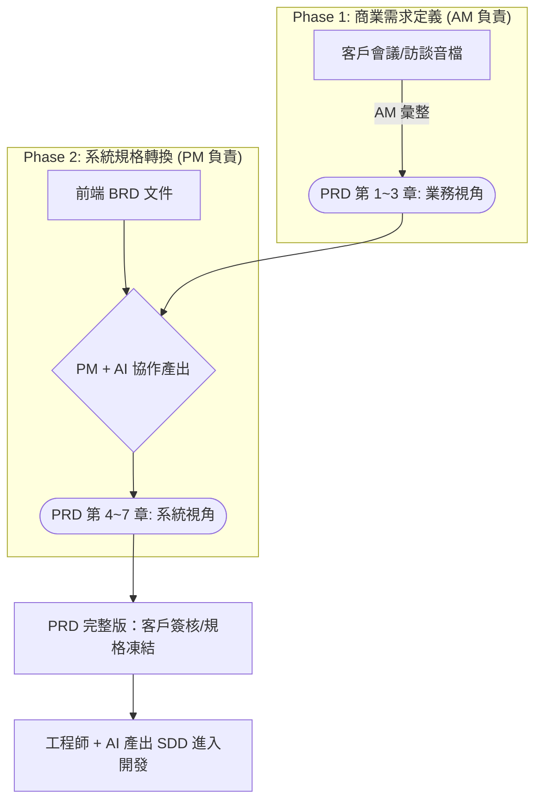

# 📖 標準化產品需求文件 (PRD) 指南與範本庫

## 🎯 這是什麼？ (Overview)
本資料夾存放公司標準化的 **產品需求文件 (Product Requirements Document, PRD)** 範本與相關生成指南。
此 PRD 範本的核心設計理念為：**「對外可作為客戶驗收的合約規格，對內可作為 AI 與工程師產出系統設計的標準輸入。」**

> **💡 核心精神**：講述商業價值與驗收邊界，**不**包含底層技術實作細節（如資料庫 Schema、演算法），技術細節將遞延至 SDD（系統設計文件）中定義。

---

## 📂 PRD 文件結構與權責劃分 (Structure Breakdown & Ownership)
本範本嚴格分為 7 大章節，請依循以下權責進行撰寫，**請勿隨意合併或調換順序**：

### 👤 [AM 負責範圍]：業務與使用者視角
1. **專案目標與商業價值**：此項目應該要從 BRD 對應文件中產出。
2. **使用者角色定義**：此項目應該要從 BRD 對應文件中產出。
3. **功能需求與使用者故事 (User Stories)**：此項目應該要從 BRD 的「核心業務需求」功能取得，且編號需要對應到 BRD 該項目的編號。

### 🛠️ [PM 負責範圍]：系統與操作視角
4. **規格說明 (Spec)**：將上述需求具象化為「欄位、權限、前/後台畫面配置、外部 API 標的」。
5. **流程圖 (UserFlow)**：以 `Mermaid` 語法呈現核心業務走向。
6. **驗收標準 (Acceptance Criteria, AC)**：最重要的一環，是客戶付款的檢查清單，也是工程師撰寫單元測試 (Unit Test) 的依據。
7. **非功能性需求**：資安、效能、併發流量等基礎建設要求。

---
## 🔄 我們的兩階段協作流程 (Two-Stage SDLC Workflow)
本 PRD 的產出採 **AM 與 PM 接力協作模式**。AM 負責確立商業價值與用戶場景，PM 則依此轉化為系統規格與驗收標準。

---

**維護者**: [負責團隊/部門名稱]  
**最後更新日期**: 2026-05-15
