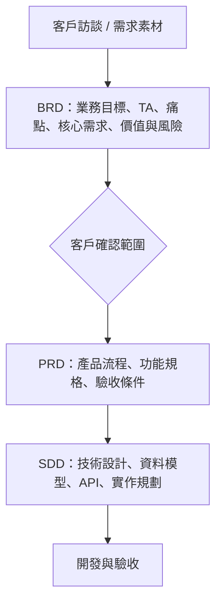

# 商業需求文件 (BRD) 撰寫指南

本指南用於規範 Aiii 專案的 BRD（Business Requirements Document）撰寫方式。BRD 的目標是把客戶需求整理成「業務可確認、PM 可轉 PRD、工程可理解方向」的共識文件，因此內容應以業務目標、使用族群、流程規則、權限邏輯、風險與商業價值為主。

撰寫時建議採用「先定義誰會使用、再說明為什麼需要做、接著拆解系統必須支援的業務流程、最後補上價值與風險」的鋪陳方式。若專案包含多角色、多模組與合規流程，應先建立角色與權限邏輯，再分別說明前台使用流程、後台管理流程、審核 / 上下架規則、操作紀錄與後續擴充需求。

> 核心原則：BRD 說明「要解決什麼業務問題」與「業務上必須成立的規則」。不要在 BRD 中深入描述 UI 元件排版、資料表設計、API 規格、錯誤碼、技術架構或工程實作細節，這些應留給 PRD / SDD。

---

## 1. BRD 整體架構

標準 BRD 以 7 大章為主，若有素材清單、名詞表、會議紀錄摘要、外部連結等補充資料，可放在第 8 章附錄。

| 章節 | 名稱           | 主要回答的問題                           | 放置內容                                         |
| ---- | -------------- | ---------------------------------------- | ------------------------------------------------ |
| 1    | 使用此功能 TA  | 誰會用？各角色為什麼用？有什麼准入條件？ | 角色、身份條件、使用目的、可見範圍、權限摘要     |
| 2    | 專案背景與痛點 | 為什麼現在要做？現況問題是什麼？         | 客戶背景、現有流程、痛點、業務影響               |
| 3    | 核心業務需求   | 本期一定要完成哪些業務能力？             | 主要模組、關鍵流程、權限規則、狀態流轉、必要紀錄 |
| 4    | 周邊業務需求   | 哪些是輔助、後續或非本期核心？           | Nice-to-have、Phase 2、外部匯出、進階報表等      |
| 5    | 預期商業價值   | 完成後帶來什麼效益？                     | 合規、效率、營收、品牌、數據、成本、ROI          |
| 6    | 利益相關者地圖 | 誰決策、誰審核、誰使用、誰維運？         | PO、決策者、影響者、管理者、終端使用者           |
| 7    | 潛在限制與風險 | 哪些因素可能阻礙上線或成效？             | 法規、資料、平台、流程、人力、採用率與對策       |
| 8    | 附錄           | 哪些資料需要保留但不應干擾主文？         | 初始素材、參考連結、名詞表、原始清單             |

---

## 2. 各章節填寫方式

### 1. 使用此功能 TA (Target Audience)

本章用來定義系統涉及的所有使用角色，以及每個角色的使用目的、准入條件與可見範圍。若系統有權限控管，應在第 1 章先建立完整角色框架，後續第 3 章再展開功能行為。

若專案同時服務前台使用者、內部業務與管理者，可用「一般使用者 / 業務使用者 / 管理者 / 最高權限管理者」的方式整理。每個角色都要說清楚進入條件、使用目的與可見範圍，例如一般使用者只使用前台產製或瀏覽功能，業務可瀏覽更多營運資訊，管理者可新增與編輯內容，最高權限管理者可審核、上架、下架或刪除。

建議結構：

- `1.1 目標受眾與使用目的`：逐一列出角色。每個角色建議包含「存取條件」、「使用目的」、「可見頁面 / 可使用功能」。
- `1.2 認證與准入機制`：說明使用者如何被辨識，以及通過條件。例如 LINE Login、CRM 驗證狀態、管理者名單。
- `1.3 權限對照表`：用表格整理角色、可見頁面、主要操作。

分類原則：

- 角色定義、身份條件、使用目的放第 1 章。
- 詳細的功能操作流程放第 3 章。
- 若同一人可能有多重身份，身份優先級應放第 1 章，並在第 3 章相關功能中重申安全規則。
- 前端顯示與後端校驗的原則可在第 1 章簡述，但 API 細節不放在 BRD。

闡述方式：

- 使用「誰 + 在什麼條件下 + 為了什麼目的 + 可做什麼」描述。
- 避免只寫角色名稱，需補充該角色在業務流程中的責任或需求。

### 2. 專案背景與痛點

本章說明專案成立的原因，讓讀者理解客戶的現況、限制與不做會造成的後果。痛點要連到業務影響，而不只是描述功能缺口。

若專案涉及醫療、金融或其他高合規產業，背景應同時交代「既有通路」、「客戶想達成的業務目標」與「合規限制」。痛點可從時效性、內容合規、人工流程、資料追蹤與成效衡量切入，例如素材審查週期過長、使用者自行製作內容造成風險、傳統傳播方式缺乏下載 / 分享 / 瀏覽紀錄等。

建議結構：

- `2.1 背景說明`：描述客戶、業務線、現有通路、使用情境與專案定位。
- `2.2 核心業務痛點`：用編號列出 2 到 5 個核心痛點。每個痛點建議包含「背景」與「影響」。

分類原則：

- 市場情境、客戶流程、合規環境放第 2 章。
- 「缺少某功能」不能只停在功能描述，需寫出造成的業務問題，例如效率低、風險高、難追蹤、觸及不足。
- 解法不要在第 2 章展開，解法放第 3 章；第 2 章只需點出為什麼需要解法。

闡述方式：

- 痛點標題應同時點出問題類型，例如「時效性痛點」、「法規風險痛點」、「成效量測痛點」。
- 每個痛點用客戶可理解的語言描述，不要使用工程術語主導敘事。

### 3. 核心業務需求 (Core Business Requirements)

本章是 BRD 的主體，用來描述本期必須成立的業務能力與流程規則。請依使用者旅程、系統模組或業務流程拆成 `3.1`、`3.2`、`3.3` 等大項，再用 `3.x.1`、`3.x.2` 拆解具體需求。

若專案是一個多頁面或多模組應用，第 3 章可先放共用的登入、身份驗證與准入，再依前台頁面與後台管理中心拆分。前台模組應描述列表瀏覽、分類篩選、詳情、產製、下載、分享等使用流程；後台模組應描述管理列表、新增、編輯、審核、上下架、刪除、通知與稽核紀錄。若有素材狀態，例如待審核、已審核、上架、下架，需用表格或流程區塊說明不同角色可執行的操作。

建議拆法：

- `3.1` 通常放跨系統或前置流程，例如登入、身份驗證、准入、全域權限。
- `3.2` 之後依主要前台模組、後台模組或核心流程排列，例如「問候圖卡頁」、「活動一覽頁」、「管理中心頁」。
- 若某模組內有列表、詳情、新增、編輯、審核、上下架、刪除等流程，應拆成獨立子編號。
- 若有狀態流轉、角色權限差異、稽核紀錄、通知規則，應放在相關模組的小節內，並用表格或流程區塊呈現。

分類原則：

- 本期必做、客戶驗收會確認的能力放第 3 章。
- 使用者可執行的主要操作放第 3 章，例如瀏覽、篩選、下載、分享、新增、編輯、審核、上下架、刪除。
- 權限與角色差異如果會影響操作結果，放第 3 章對應流程下。
- 素材狀態、審核狀態、上架狀態、通知觸發、操作 log 等業務規則放第 3 章。
- 未確定是否本期交付的功能不要混在第 3 章，應移到第 4 章。
- 純資料清單、初始素材 URL、參考資料不要放第 3 章，應放第 8 章附錄。

闡述方式：

- 每個需求小節先用一句話說明「誰可以做什麼」，再補充限制、規則、紀錄與例外。
- 若牽涉合規或權限，需明確寫出「可做」與「不可做」。
- 可使用表格整理角色權限、狀態權限、通知對象、分類欄位。
- 可使用簡短流程圖或狀態流轉區塊，但不要寫成工程 pseudo code。

摘要範例：

- 「HCP 可下載圖卡，業務不可下載」應放在 `3.x 下載 / 分享 / 前台操作`。
- 「指定最高管理者可審核、上架、下架」應放在 `3.x 管理中心` 的權限規則與對應操作小節。
- 「每次下載需記錄 UID、素材 ID、時間」應放在該操作小節，因為這是核心行為的必要紀錄。
- 「未來要把數據定期匯出到 sFTP」若非本期，放第 4 章。

### 4. 周邊業務需求 (Peripheral Business Requirements)

本章放輔助核心流程、非本期交付、待確認、Phase 2 或 Nice-to-have 的需求。這些需求對未來有價值，但不應影響本期核心範圍的判斷。

若客戶提出資料匯出、外部系統串接、進階分析或自動化通知，但尚未確認本期範圍，應放在本章。例如將下載、分享、活躍使用者或活動曝光等成效資料定期匯出至客戶指定系統，若只是後續期待，不應放入第 3 章核心承諾。

分類原則：

- 未明確承諾本期交付的功能放第 4 章。
- 外部系統串接、進階報表、自動匯出、多語系、進階通知等若只是後續期待，放第 4 章。
- 若客戶期待但規格未定，需標示「待確認」或「後續版本」。

闡述方式：

- 每個項目需說明它服務哪個核心目標，以及為什麼不屬於本期核心。
- 不要在第 4 章寫得比第 3 章更細，避免讀者誤判為本期承諾。

### 5. 預期商業價值 (Expected Business Value)

本章描述專案完成後對客戶與公司帶來的價值。應把價值連回第 2 章痛點與第 3 章需求，避免空泛口號。

價值描述應對應前述痛點，例如透過預審內容與封閉式選項降低合規風險，透過自助管理降低工程維護成本，透過列表、月曆或篩選提升活動觸及，透過操作紀錄與後續資料匯出支持數據化決策。每一點都應寫成業務結果，而不是功能重述。

分類原則：

- 合規風險降低、流程效率提升、品牌觸及增加、數據可追蹤、營運成本下降、ROI 改善等放第 5 章。
- 若有量化指標可寫入，例如節省工時、提升觸及、降低人工維護次數；若尚無數字，可先寫定性價值。
- 成本天、人力、預算若尚未評估，可標示「待評估」。

闡述方式：

- 用條列方式，每點以價值類型開頭，再說明如何產生價值。
- 優先寫業務結果，不要只重述功能。

### 6. 利益相關者地圖 (Stakeholder Map)

本章盤點專案中會決策、審核、提供資料、使用系統或維運的人。若有已知姓名、單位與職責，建議用表格整理。

若專案牽涉客戶內部多個團隊，至少應列出業主 / PO、行銷或業務主管、合規審核者、終端使用者、業務代表、內容管理者與最高權限審核者。第 6 章描述的是專案責任，例如需求確認、內容策略、合規審核、素材新增、素材審核與日常使用，不是重複第 3 章的功能規格。

分類原則：

- 決策者、PO、行銷主管、法遵 / Compliance、IT、管理者、終端使用者、外部廠商都可放第 6 章。
- 角色在系統中的功能權限仍以第 1 章與第 3 章為主，第 6 章只描述專案責任與協作關係。

闡述方式：

- 建議表格欄位為「角色」、「單位 / 人員」、「職責」。
- 若姓名未定，可先寫角色或團隊名稱，避免阻塞 BRD 產出。

### 7. 潛在限制與風險 (Potential Constraints & Risks)

本章列出可能影響上線、合規、營運、資料品質或使用成效的風險，並提出初步對策。風險不是需求，也不是功能列表，應聚焦在「可能發生什麼問題」與「如何降低影響」。

風險應從專案實際依賴與營運條件整理，例如內容外流、身份資料不準、合規審核延遲、第三方平台服務異動、使用者採用率不足、素材供給不足、個資或資料落地要求未確認等。每個風險都要補上對策，例如僅上架已審核內容、建立異常回報流程、配置備援審核者、使用標準平台能力或先向法遵確認資料儲存要求。

建議結構：

- 每個風險使用 `7.1`、`7.2` 等獨立小節。
- 小節先描述風險，再用條列寫可能影響與對策。

分類原則：

- 法規合規、資料落地、身份驗證依賴、平台依賴、審核流程瓶頸、素材供給、使用者採用率等放第 7 章。
- 若某風險已對應到核心需求中的防範規則，可在第 7 章再次以風險視角說明。
- 不要把未來功能塞進風險章節；若是需求，放第 3 或第 4 章。

闡述方式：

- 標題需明確指出風險類型，例如「身份驗證依賴風險」。
- 對策應可執行，例如建立 SLA、指定備援人員、確認資料儲存區域、建立異常回報流程。

### 8. 附錄 (Appendix，可選)

附錄用來保存支援 BRD 的原始資料或清單，不屬於核心敘事。附錄可存在，但不得取代第 1 到第 7 章的需求說明。

若專案有初始素材、圖片連結、活動資料、問候語文案、客戶提供的原始清單或外部檔案連結，應集中放在附錄。主文只說明這些素材如何被分類、審核、上架與使用；附錄才保存完整清單。

適合放附錄的內容：

- 初始素材清單。
- 客戶提供的原始連結。
- 名詞表。
- 欄位初稿。
- 參考文件。
- 會議紀錄摘要。

不適合只放附錄的內容：

- 核心流程。
- 權限規則。
- 驗收會關注的本期需求。
- 會影響範圍與報價的功能。

---

## 3. 編號與層級規則

請使用 Markdown 標題與數字編號維持一致層級。

- `## 1.` 到 `## 7.` 為主要章節。
- `### 1.1`、`### 3.2` 為章節內的大分類。
- `#### 3.2.1`、`#### 3.4.8` 為具體需求或流程步驟。
- 同一層級的內容應維持同一顆粒度，不要讓 `3.2.1` 是完整模組、`3.2.2` 卻只是單一欄位。
- 第 3 章的子編號建議依使用者旅程排序，而不是依資料表或技術模組排序。
- 若需求橫跨多個角色，先放在主要流程下，再用表格標示角色差異。

---

## 4. 常見內容歸類判斷

| 內容                                      | 應放章節 | 判斷理由               |
| ----------------------------------------- | -------- | ---------------------- |
| 使用者角色、身份條件、可見頁面            | 第 1 章  | 先建立 TA 與權限框架   |
| 客戶為何需要此系統                        | 第 2 章  | 屬於背景與痛點         |
| 本期登入、驗證、准入流程                  | 第 3 章  | 屬於核心業務流程       |
| 前台列表、篩選、詳情、下載、分享          | 第 3 章  | 屬於使用者主要操作     |
| 後台新增、編輯、審核、上下架、刪除        | 第 3 章  | 屬於管理流程與權限規則 |
| 狀態流轉與稽核日誌                        | 第 3 章  | 會影響核心流程與合規   |
| 未來 sFTP 匯出、進階報表                  | 第 4 章  | 非本期或待確認需求     |
| 專案效益、ROI、品牌與效率價值             | 第 5 章  | 屬於商業價值           |
| PO、法遵、行銷、IT、終端使用者            | 第 6 章  | 屬於專案協作關係       |
| CRM 資料不準、LINE 平台異動、素材供給不足 | 第 7 章  | 屬於潛在限制與風險     |
| 素材 URL 清單、原始資料表                 | 第 8 章  | 補充資料，不應干擾主文 |

---

## 5. 寫作語氣與品質檢查

BRD 應使用清楚、可確認、可轉換成 PRD 的語句。建議採用以下寫法：

- 用「系統需支援」、「使用者可」、「僅某角色可」、「不得」、「需記錄」描述業務規則。
- 對權限、狀態、流程、通知、紀錄等高風險內容要明確。
- 對待確認事項加上「待客戶確認」、「待法遵確認」、「建議」等標示。
- 避免使用模糊字眼，例如「可能要」、「看情況」、「做得方便一點」。
- 避免寫入過細 UI 或技術內容，例如按鈕位置、資料庫欄位型別、API endpoint、前端框架。

完成 BRD 前請檢查：

- 第 1 章是否列出所有角色與准入條件。
- 第 2 章痛點是否能解釋第 3 章需求的必要性。
- 第 3 章是否只放本期核心需求，且每個模組都有清楚編號。
- 第 4 章是否把非本期需求與第 3 章分開。
- 第 5 章是否有對應痛點的商業價值。
- 第 6 章是否涵蓋決策、審核、使用與維運相關人員。
- 第 7 章是否包含風險與初步對策。
- 附錄是否只放補充資料，而非核心需求。

---

## 6. 與後續文件的關係

BRD 完成並經客戶確認後，PM 會將第 3 章核心業務需求轉換成 PRD，補上使用者故事、功能規格、驗收條件、頁面流程與例外情境。工程團隊再依 PRD 與 SDD 補足技術設計、資料模型、API 與實作細節。

